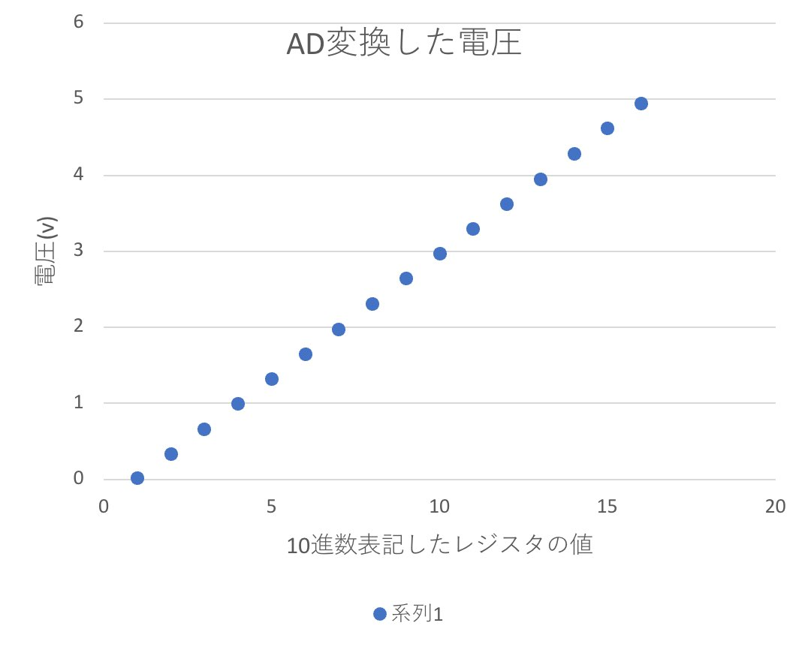

## 3I04 市川 敬士

# A/D変換

## 1. 抵抗ラダー型D/A

### 内容

- AVRに4ビットD/A変換回路を接続し、VoにPB(PB3 PB2 PB1 PB0)にほぼ比例した電圧が出力されることを確かめよ。  
またVoを計測しなさい。

- コード

```c
#include <asf.h>
#define F_CPU 20000000UL
#include <util/delay.h>
int main() //IO ポート設定
{
	DDRB = 0b00001111;
	int c = 0;
	while(true){
		c++;
		PORTB = c;
		_delay_us(20000000);
	}
	return 0;
}
```

- 表



- グラフ


## 2. コンパレータ

### 穴埋め

1. データシート

2. 前知識

3. 概要

- 比較器を使用するには、ACDをOFFにする。
- 入力端子は+端子の**AIN0**と-端子の**AIN1**であり、この電圧を比較する。
- 比較するには、ACBGを論理値**0**、ACMEを論理値**0**、ADENを論理値**1**にすればよい。
- この図の他、以下のページ、項目を参照する。
  - **243**ページ**表23-1**
  - **12**ページ**図1-1**
  - **97**ページ**表14-9**

4. ピン配置

- ピン配置は図**1-1**、表**14-9**を参照すればいい。
- AIN0はポート**D**の**6**bit目、ICの**8**番ピンである。
- AIN1はポート**D**の**7**bit目、ICの**9**番ピンである。

5. 省電力設定

- ADCについては、**244**ページに書かれている。
- ADCを使用するには、PRADCを論理値**0**にする。
- PRADCは**Power Reduction**レジスタの**0**ビット目である。
- PRADCが論理値**1**の時とき、コンパレータはADC input MUXを使用できない。
- ディジタル入力にはディセーブル機能があり、**Digital Input Disable**レジスタ(**245**ページ)、**Digital Input Disable**レジスタ(**260**ページ)で設定する
- AIN1、AIN0を使用する場合、AIN1D、AIN0Dを論理値**1**にセットし、ディジタル入力バッファをディセーブルにすることができる。

6. その他のパラメータ

- ACMEは**ADCSRB**レジスタの**6**ビット目である。  
論理値**0**のとき、-入力端子AIN1がコンパレータに接続される。
- ADENは**ADCSRA**レジスタの**7**ビット目である。  
論理値**0**のとき、ADCがOFFになる。
- ACOは**ACSR**レジスタの**5**ビット目である。コンパレータ出力端子。
- ACDは**ACSR**レジスタの**7**ビット目である。  
論理値**1**のとき、コンパレータがOFFになる。
- ACBGは**ACSR**レジスタの**6**ビット目である。  
論理値**0**のとき、+入力端子AIN0がコンパレータに接続される。
- ACDは論理値**1**で比較器の電源がOFFになる。
- ACOには**1~2**クロック分のディレイが発生する。

7. まとめ

|レジスタ|アドレス|0に設定するビット|1に設定するビット
|:---|:---|:---|:---
|PRR|0x64|なし|0  
|ACSR|0x30|7,6|なし
|ADCSRA|0x7A|なし|7
|ADCSRB|0x7B|6|なし
|DIDR0|0x7E|なし|0,1,2,3,4,5
|DIDR1|0x7F|なし|1,0

8. 遅延時間

比較器の遅延時間(Propagation Delay)を調べる。表30-1のDC特性を参照する。  
表から2.7Vで**750**ns(標準)、4Vで**500**ns(標準)である。遅延時間は一般に電圧が高いほど短くなるから、5Vでは**500**ns(最大)と予想する。これは、20MHz動作で**10**クロックに相当する。  
さらにACOがセットされるまでに**1~2**クロック必要だから、比較器への入力が安定後、合計**11~12**クロック(**0.6**μs)必要であることがわかる。

9. プログラミング基礎知識(補足)

- 例えば、

|レジスタ|アドレス
|:---|:---
|PINB|0x03番地
|PORTB|0x05番地
|DDRB|0x04番地
|PRR|0x64番地

- IN、OUT命令は、**0x00~0x3F**番地のアドレスに対して使用
- LDS、STS命令は**0x60~0xFF**番地のアドレスに対して使用
- SBI、CBI命令は**0x00~0x1F**番地のアドレスに対して使用

### 1. テキスト「コンパレータの使い方」をもとにコンパレータを設定し、動作を確認しなさい。V+に三角波(ファンクションジェネレータ)、V-に定電圧(2.5V)を与えオシロスコープで確認すること。

- 結果


- コード
```c
#define F_CPU 20000000UL
#include <asf.h>
#include <util/delay.h>
int main (void)
{
	DDRB = 0b11111111;
	DDRD = 0b00000000;
	PRR = PRR | (1<<0);
	ACSR = ACSR & (~(1<<6));
	ACSR = ACSR & (~(1<<7));
	ADCSRA = ADCSRA | (1<<7);
	ADCSRB = ADCSRB & (~(1<<6));
	DIDR0 = DIDR0 | (1<<0);
	DIDR0 = DIDR0 | (1<<1);
	DIDR0 = DIDR0 | (1<<2);
	DIDR0 = DIDR0 | (1<<3);
	DIDR0 = DIDR0 | (1<<4);
	DIDR0 = DIDR0 | (1<<5);
	DIDR1 = DIDR1 | (1<<0);
	DIDR1 = DIDR1 | (1<<1);
	while(true){
		_delay_us(0.6);
		if((ACSR & (1 << 5))!=0){
			PORTB = 0b00000000;
		}else if((ACSR & (1 << 5))==0){
			PORTB = 0b11111111; 
		}
	}
}
```

オシロスコープの写真

### 2. VoをV-に接続する。

- 結果

  

- Voが安定するまでの時間

オシロスコープの結果を見るに、立上り、立下り共にVoが安定するまでにおおよそ300nsを要した。

- コード

```c
#define F_CPU 20000000UL
#include <asf.h>
#include <util/delay.h>
int main (void)
{
	DDRB = 0b11111111;
	DDRD = 0b00000000;
	PRR = PRR | (1<<0);
	ACSR = ACSR & (~(1<<6));
	ACSR = ACSR & (~(1<<7));
	ADCSRA = ADCSRA | (1<<7);
	ADCSRB = ADCSRB & (~(1<<6));
	DIDR0 = DIDR0 | (1<<0);
	DIDR0 = DIDR0 | (1<<1);
	DIDR0 = DIDR0 | (1<<2);
	DIDR0 = DIDR0 | (1<<3);
	DIDR0 = DIDR0 | (1<<4);
	DIDR0 = DIDR0 | (1<<5);
	DIDR1 = DIDR1 | (1<<0);
	DIDR1 = DIDR1 | (1<<1);
	bool flag = true;
	while(true){
		_delay_us(120);
		if(flag){
			flag = false;
			PORTB = 0b11111111;
		}else{
			flag = true;
			PORTB = 0b00000000;
		}
	}
}
```

## 3. A/D変換

1. アセンブリ言語を用いてプログラムを作成せよ。

コード

- 今回はD/A変換出力の変位を見やすくするために待機時間を120μsと設定しているが、最低必要時間は0.3μsである。

```c
#define F_CPU 20000000UL
#include <asf.h>
#include <util/delay.h>
int main (void)
{
	DDRB = 0b11111111;
	DDRD = 0b00000000;
	PRR = PRR | (1<<0);
	ACSR = ACSR & (~(1<<6));
	ACSR = ACSR & (~(1<<7));
	ADCSRA = ADCSRA | (1<<7);
	ADCSRB = ADCSRB & (~(1<<6));
	DIDR0 = DIDR0 | (1<<0);
	DIDR0 = DIDR0 | (1<<1);
	DIDR0 = DIDR0 | (1<<2);
	DIDR0 = DIDR0 | (1<<3);
	DIDR0 = DIDR0 | (1<<4);
	DIDR0 = DIDR0 | (1<<5);
	DIDR1 = DIDR1 | (1<<0);
	DIDR1 = DIDR1 | (1<<1);
	PORTB = 0b00000000;
	while(true){
		PORTB = 0b00000000;
		_delay_us(120);
		for(int i = 3;i >= 0;i--){
			PORTB = PORTB | (1 << i);
			_delay_us(120);
			if((ACSR & (1 << 5))==0){
				PORTB = PORTB & (~(1 << i));
			}
		}
		_delay_us(120);
	}
}
```

2. 電源から定電圧を入力し、ディジタル値が求められる様子を確認せよ(2例)

- 結果


3. A/D変換中に入力電圧が変化するとどのようになるか。実験で確認せよ。

- 検証方法

ファンクションジェネレータを用い、正弦波を入力させた。

- 結果


## 課題

1. 必要なA/D変換時間はどのように考えればよいか。

D/A出力電圧が入力電圧と比較するために、bitに対して0->1と変換する操作を行った場合0.3μs待機させる必要がある。  
また、もし0bit目を0に設定するのが最適解であった場合、最後にbit操作を行ってからD/A出力電圧が安定するまで0.3μs待つ必要がある。  
従って、最大必要待機時間は0bit目が0に設定する際の1.5μs、最小待機時間は0bit目が1に設定する際の1.2μs。

2. A/D変換機の前段にサンプリング・ホールド回路を用いることがある。これについて調査しなさい。

- 参考

サンプルアンドホールド回路は、連続的に変化するアナログ信号の電圧をサンプリング（キャプチャ、取得）し、指定された最小期間、その値を一定のレベルで保持（ロック、フリーズ）するアナログデバイスです。  
サンプルアンドホールド回路と関連するピーク検出器は、基本的なアナログメモリデバイスです。  
ピーク検出器はサンプリング・ホールド回路がサンプリングしたデータから最大値/最小値を求め、それらをペアにして表示するものである。
これらは通常、アナログ-デジタルコンバーターで使用され、変換プロセスを台無しにする可能性のある入力信号の変動を排除します。

参考: [wikipedia](https://en.wikipedia.org/wiki/Sample_and_hold#References)

- 考察

以上より、サンプリング・ホールド回路はA/D変換を行うにあたって不要、例外となる値を先に排斥するために用いられると考えられる。

3. 今回のようなプログラムを作成する場合、C言語、アセンブリ言語のどちらを使用するべきか。  
自分の考えを述べなさい。

- 解答

  - 両者のコードを見て考慮すると、for文をアセンブリ言語で実装した際の視認性、及びdelay関数を自作しなくてはならない点。そして、while文の内部にforが存在していることを認知しづらい点から考慮するとC言語を用いるべきである。
  - 両者の言語から考慮するならば、アセンブリ言語の方がポートやレジスタに対する制御は行いやすいが、C言語でも最低限扱えるためどちらでもよいといえる。
  
以上より、今回の実験であればC言語を用いるべきだと感じた。

## 応用

1. スイッチを押すと、(1回だけ)AD変換するようにしなさい。
どのようにすれば、オシロスコープで表現できるか考えること。

- 解答

前回の実験で行った割り込み検知を用い、もし割り込みが行われた際の動作として以下の操作を行えばよい。

```c
PORTB = 0b00000000;
_delay_us(120);
for(int i = 3;i >= 0;i--){
	PORTB = PORTB | (1 << i);
	_delay_us(120);
	if((ACSR & (1 << 5))==0){
		PORTB = PORTB & (~(1 << i));
	}
}
_delay_us(120);
```